# GitHub Repo Analyzer

Visual-first analyzer for any public GitHub repository. Backend: FastAPI. Frontend: React + Tailwind. Deployable on Render (backend web service + frontend static site).

## Quick Start

### Prereqs
- Python 3.11+
- Node 20+
- (Optional) GitHub token for higher rate limits: set `GITHUB_TOKEN` in environment

### Backend (FastAPI)
```python
python -m venv .venv
. .venv/Scripts/activate  # Windows PowerShell: .venv\Scripts\Activate.ps1
pip install -r backend/requirements.txt
uvicorn app.main:app --reload --port 8000 --app-dir backend
```

### Frontend (React + Vite + Tailwind)
```
cd frontend
npm install
npm run dev
```

### Environment
Create `.env` at repo root or under `backend/` with:
```
GITHUB_TOKEN=
```

## Visual Setup Guide

```mermaid
flowchart LR
  A[📥 Clone] --> B[⚙️ Install Backend]
  B --> C[▶️ Run Backend]
  A --> D[⚙️ Install Frontend]
  D --> E[▶️ Run Frontend]
  C --> F[🌍 Deploy on Render]
  E --> F
```


## CI (GitHub Actions)

A sample workflow is included at `.github/workflows/repo-analyzer.yml`. It installs backend dependencies, runs the analyzer CLI on a provided repository input, and uploads the `report/analysis.json` artifact.

## CLI

A minimal offline CLI is available:

```bash
python -m app.cli owner/name --pretty
```

This calls the same internal routines as the API and prints a JSON summary to stdout.

## Features

- Repo metadata (stars, forks, issues, license, last push, topics)
- Language distribution (bytes, files, lines)
- Tech stack detection (FastAPI, React, Docker, CI, tests, etc.)
- Static analysis summary (radon MI, flake8) with charts
- Contributors and weekly activity
- README visual map (mermaid) and section insights
- Health score and SVG badge endpoint
- Architecture graph (Python, JS/TS, Go, Java, C#, PHP, Ruby)
- File hotspots (git history)
- Code Quality upgrades: coverage% (if coverage.xml found) and letter grade (A–F)
- Community and Security badges (SVG)
- Multi‑repo Tech Radar (aggregate stacks across repos)
- Export report as PDF

## Tech Radar

Open http://localhost:5173 and analyze a repository (e.g. `vercel/next.js`). Use the top‑right "Tech Radar" button to switch between the Analyzer and the Tech Radar view.

Tech Radar view accepts a comma or newline separated repo list (up to 25). Presets are available.

## Deploy on Render
This repo includes `render.yaml` to create:
- Web Service: FastAPI backend (Dockerfile in `backend/`)
- Static Site: Frontend built with Vite (publish `frontend/dist`)

After pushing to GitHub, click "New +" → "Blueprint" in Render and point to this repo.
